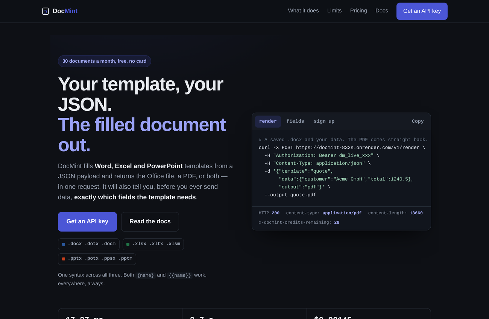

# DocMint

**POST your JSON against a Word, Excel or PowerPoint template. Get the Office file, a
PDF, or both.**

DocMint fills `.docx`, `.xlsx` and `.pptx` templates from a workflow — no Office
install, no COM automation, no per-format library to license. It will also tell you
what fields a template needs before you send any data, and it **refuses to render a
document with an unresolved placeholder** instead of shipping one with a hole in it.

There is a hosted service at
**[docmint.app.mintapis.com](https://docmint.app.mintapis.com)** — 30 documents a
month free, no card — and an
[n8n community node](https://github.com/fstandhartinger/n8n-nodes-docmint) that turns a
template's placeholders into real n8n fields.

This repository is the API behind both.

## Make your first document

[Create a free account](https://docmint.app.mintapis.com/signup), copy its API key,
and run this from a clone of this repository (`git clone
https://github.com/fstandhartinger/docmint.git && cd docmint`). You need Node.js
20+ and curl, but **no npm install, Office installation or template upload**.
The request uses the existing [sales-report example](examples/README.md#2-sales-reportxlsx)
and its complete sample data, rather than a template name your new account does
not have yet.

```bash
export DOCMINT_API_KEY='paste-your-api-key-here'
node -e 'const fs=require("node:fs"); process.stdout.write(JSON.stringify({template_base64:fs.readFileSync("examples/sales-report.xlsx").toString("base64"),data:JSON.parse(fs.readFileSync("examples/sales-report.data.json","utf8")),output:"document"}))' > request.json
curl --fail-with-body --max-time 120 \
  https://docmint.app.mintapis.com/v1/render \
  -H "Authorization: Bearer $DOCMINT_API_KEY" \
  -H "Content-Type: application/json" \
  --data-binary @request.json \
  --output filled-sales-report.xlsx
```

Open `filled-sales-report.xlsx`: it contains the filled sales workbook, including
the regional summary. This costs **one of your 30 free credits**. For a PDF,
change `output:"document"` to `output:"pdf"` and the output filename to
`filled-sales-report.pdf`; that costs **two credits**. If curl reports an HTTP
error, the output file contains the API's JSON explanation, not an Office file.
Check your remaining credits with:

```bash
curl --fail-with-body https://docmint.app.mintapis.com/v1/usage \
  -H "Authorization: Bearer $DOCMINT_API_KEY"
```

For n8n, use the [existing DocMint node setup guide](https://docmint.app.mintapis.com/n8n-word-template)
instead; you do not need to write the HTTP request yourself.



## What it does

| Endpoint | What it is for |
| --- | --- |
| `POST /v1/render` | Template + data → the Office file, a PDF, or both |
| `POST /v1/render/batch` | Many documents in one call |
| `POST /v1/inspect` | Upload a template, get its fields back — no render, no credit |
| `GET /v1/templates/:name/fields` | The same, for a template already stored |
| `POST /v1/templates` | Store a template; versions and `rollback` included |
| `POST /v1/jobs` | The same renders, asynchronously, with a webhook |
| `GET /v1/capabilities` | What this deployment can actually do, from the code |
| `GET /v1/usage` | Plan, credits used, credits left |

One placeholder syntax across all three formats, images included: `{{customer.name}}`,
loops, conditionals and table-row expansion behave the same in a Word document, a
spreadsheet and a slide deck.

**The fill engine is ours.** `SPEC.md` explains why: the obvious library covers DOCX
and PPTX for free but hard-codes XLSX behind a paid module, along with images and
HTML-into-DOCX. Writing the OOXML work ourselves meant one syntax everywhere, no paid
ladder later, and full control over the behaviour this product is judged on — failing
loudly on an unresolved placeholder, by name and by location.

LibreOffice (MPL-2.0, from the Debian archive) does the PDF conversion.

The full reference is at
[docmint.app.mintapis.com/docs](https://docmint.app.mintapis.com/docs).

## Plans

| Plan | Documents / month | Price |
| --- | ---: | ---: |
| Free | 30 | $0 |
| Starter | 2,000 | $9 |
| Pro | 20,000 | $29 |
| Scale | 100,000 | $99 |

A PDF conversion costs a credit on top of the fill, because it costs a LibreOffice
process. The docs say so on the pricing section rather than in a footnote.

## What it costs to run

The canonical hosted service runs on Sandy via Coolify; see [DEPLOY.md](DEPLOY.md)
for its repository, branch and deployment process. A legacy Render endpoint is
also retained for existing integrations. The old Render/Neon inventory in
`ops/INFRASTRUCTURE.md` is historical, not a current total-cost estimate or a
safe teardown checklist for the hosted service.

LibreOffice peaks at **219 MB** per conversion, measured — which is why
`MAX_CONCURRENT_PDF` defaults to 1 in a 512 MB container.

## Running it yourself

A plain Express app, a Postgres database, and `soffice` on the PATH for PDF output.
The Dockerfile installs `libreoffice-core` and `libreoffice-writer`.

```bash
npm install
cp .env.example .env.local     # DATABASE_URL and SESSION_SECRET are the only ones needed
npm run migrate
npm start                      # http://localhost:3000
npm test                       # needs a database; Stripe tests skip without keys
```

Without `soffice`, everything still works except `"output":"pdf"`, and
`GET /v1/capabilities` says so rather than failing at render time.

## Related

- [n8n-nodes-docmint](https://github.com/fstandhartinger/n8n-nodes-docmint) — the n8n
  community node. It reads your template and builds one typed, expression-capable n8n
  field per placeholder, named from the document itself.
- [PDFMint](https://github.com/fstandhartinger/pdfmint) — the same idea for HTML,
  Markdown and URLs.

## License and status

Run by one person. Issues and pull requests are read. If a document comes out wrong, an
issue with the id from the `X-DocMint-Request-Id` header is enough to find it in the
logs.
